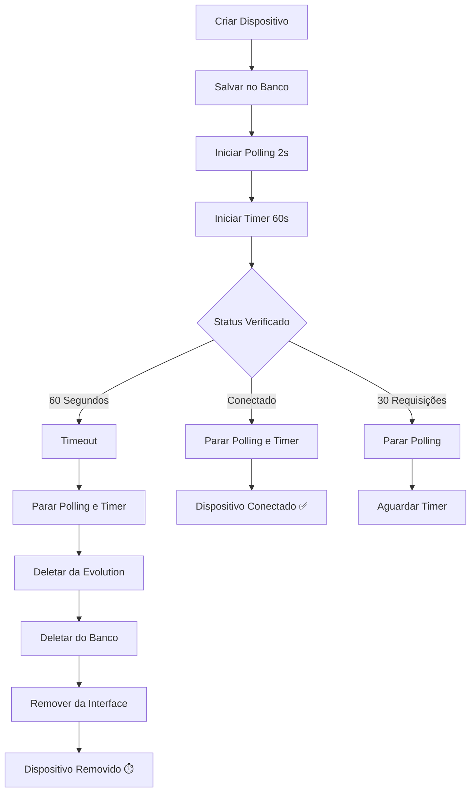

# Sistema de Timeout e Proteção Anti-Flood

## 📋 Visão Geral

Sistema de segurança implementado para proteger o webhook n8n contra flood de requisições durante o processo de conexão do WhatsApp via QR Code.

## 🎯 Características Principais

### 1. **Limite de Polling**
- **Máximo**: 30 requisições por dispositivo
- **Intervalo**: 2 segundos entre cada requisição
- **Tempo total**: 60 segundos (30 × 2s)
- **Proteção**: Para automaticamente após atingir o limite

### 2. **Timer Visual**
- **Countdown**: 60 segundos exibido ao lado do QR Code
- **Alerta visual**: Pisca em vermelho nos últimos 10 segundos
- **Formato**: `⏱️ XXs` (emoji + segundos restantes)
- **Cores**:
  - 🔵 Azul: 60s → 11s (normal)
  - 🔴 Vermelho piscando: 10s → 0s (urgente)

### 3. **Auto-Cleanup**
Quando o tempo expira (60 segundos), o sistema automaticamente:
1. **Para o polling** (para de fazer requisições)
2. **Remove do banco de dados SQLite**
3. **Remove da Evolution API** via webhook DELETE
4. **Remove da interface** (lista de dispositivos)
5. **Exibe mensagem** de timeout ao usuário

## 🔧 Implementação Técnica

### Estados e Refs Adicionados

```typescript
// Contador de requisições por dispositivo
const pollingCounters = useRef<Map<string, number>>(new Map())

// Timers de timeout (1s cada)
const timeoutTimers = useRef<Map<string, NodeJS.Timeout>>(new Map())

// Segundos restantes por dispositivo (para UI)
const [remainingSeconds, setRemainingSeconds] = useState<Map<string, number>>(new Map())
```

### Funções Principais

#### `startPolling(deviceName: string)`
- Inicializa contador em 0
- Cria intervalo de 2s
- Incrementa contador a cada requisição
- Para automaticamente ao atingir 30 requisições
- Chama `checkConnectionStatus()` a cada ciclo

#### `startTimeoutTimer(deviceName: string, deviceId: string)`
- Inicia countdown de 60 segundos
- Atualiza UI a cada segundo
- Chama `handleDeviceTimeout()` ao expirar

#### `handleDeviceTimeout(deviceId: string, deviceName: string)`
- Para polling e timers
- Deleta da Evolution API (webhook leticia-wb3)
- Deleta do banco SQLite
- Remove da interface
- Mostra notificação de erro

#### `deleteDeviceFromEvolution(instanceName: string)`
- Endpoint: `https://n8n.sofia.ms/webhook/leticia-wb3`
- Método: DELETE
- Body: `{ instanceName: "nome-do-dispositivo" }`
- Tratamento de erro silencioso (não bloqueia)

### Fluxo de Execução



## 📊 Métricas de Segurança

### Proteção Contra Flood

| Métrica | Valor | Descrição |
|---------|-------|-----------|
| **Requisições/minuto** | 30 | Máximo de requisições por dispositivo |
| **Intervalo mínimo** | 2s | Tempo entre requisições |
| **Timeout total** | 60s | Tempo máximo de polling |
| **Auto-cleanup** | Sim | Remove automaticamente ao expirar |

### Cenários de Teste

#### ✅ Cenário 1: Conexão Bem-Sucedida
1. Usuário cria dispositivo
2. QR Code é exibido com timer de 60s
3. Usuário escaneia em 15s
4. Polling detecta conexão na 8ª requisição
5. Timer e polling param automaticamente
6. Dispositivo fica online ✅

**Requisições feitas**: 8 (16 segundos)

#### ⏱️ Cenário 2: Timeout
1. Usuário cria dispositivo
2. QR Code é exibido com timer de 60s
3. Usuário não escaneia
4. Timer chega a 0s
5. Sistema remove automaticamente
6. Mostra mensagem de erro

**Requisições feitas**: 30 (60 segundos máximo)

#### 🛑 Cenário 3: Limite de Requisições
1. Usuário cria dispositivo
2. 30 requisições são feitas em 60s
3. Polling para automaticamente
4. Timer continua contando
5. Ao chegar a 0s, remove dispositivo

**Requisições feitas**: 30 (máximo atingido)

## 🎨 Interface do Usuário

### Timer Visual

```tsx
{remainingSeconds.has(device.name) && (
  <span className={`text-xs font-mono px-2 py-0.5 rounded ${
    (remainingSeconds.get(device.name) || 0) <= 10
      ? 'bg-red-500/20 text-red-400 animate-pulse'  // Últimos 10s
      : 'bg-blue-500/20 text-blue-400'              // Normal
  }`}>
    ⏱️ {remainingSeconds.get(device.name)}s
  </span>
)}
```

### Mensagens ao Usuário

- **Sucesso**: "Dispositivo criado com sucesso!"
- **Timeout**: "Dispositivo removido: tempo limite de 60s excedido"
- **Delete manual**: "Dispositivo removido com sucesso"

## 🔒 Benefícios de Segurança

1. **Proteção do n8n**: Máximo de 30 requisições por dispositivo
2. **Experiência do usuário**: Timer visual cria urgência
3. **Limpeza automática**: Não acumula dispositivos não conectados
4. **Sincronização**: Remove de todos os lugares (DB + Evolution + UI)
5. **Feedback claro**: Usuário sabe exatamente quanto tempo tem

## 📝 Logs do Console

```bash
# Criação
💾 Salvando dispositivo no banco: {name: "teste", ...}

# Polling
🔍 Resposta do webhook status: {success: true, data: [...]}
📱 Dados da instância: {connectionStatus: "connecting", ...}

# Limite atingido
🛑 Polling limitado: 30 requisições atingidas para teste

# Timeout
⏱️ Timeout: Removendo dispositivo teste após 60 segundos sem conexão

# Conexão bem-sucedida
✅ Instância conectada! Atualizando interface...
```

## 🚀 Próximas Melhorias Possíveis

1. **Configurável**: Permitir ajustar timeout via config
2. **Retry**: Permitir tentar novamente após timeout
3. **Notificações**: Som ou notificação browser nos últimos 10s
4. **Analytics**: Registrar tempo médio de conexão
5. **Histórico**: Manter log de timeouts para análise

## 📚 Referências

- **n8n Webhooks**:
  - Create: `POST https://n8n.sofia.ms/webhook/leticia-wb`
  - Status: `GET https://n8n.sofia.ms/webhook/leticia-wb2?instanceName=X`
  - Delete: `DELETE https://n8n.sofia.ms/webhook/leticia-wb3`

- **Banco de dados**: `/database/schema.sql` (tabela `whatsapp_devices`)
- **Backend**: `/server.cjs` (endpoints `/api/whatsapp-devices`)
- **Frontend**: `/src/components/DevicesPanel.tsx`
