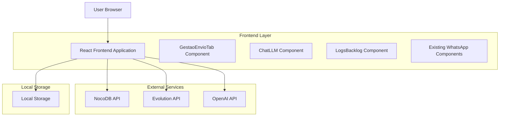
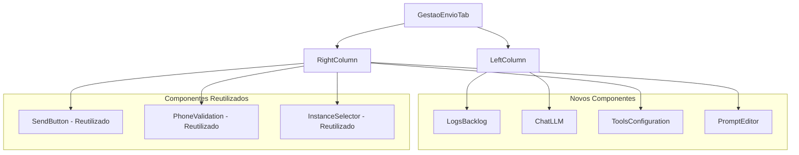
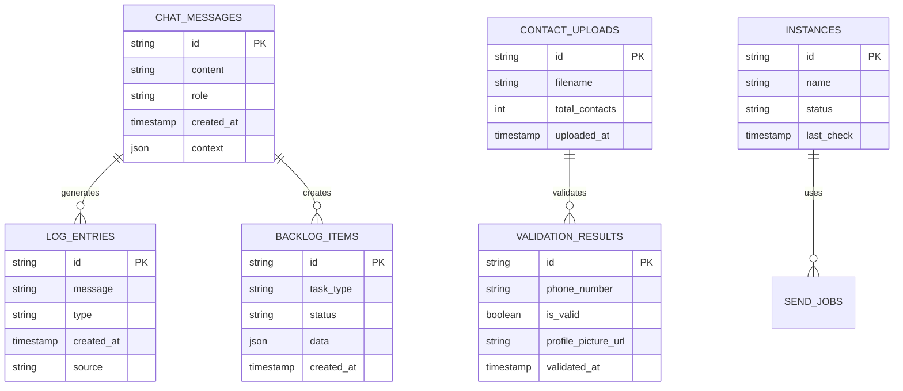

# Painel Gestão de Envio - Documento de Arquitetura Técnica

## 1. Design da Arquitetura



## 2. Descrição da Tecnologia

- Frontend: React@18 + TypeScript + TailwindCSS@3 + Vite
- Backend: NocoDB (banco de dados e APIs)
- APIs Externas: Evolution API (WhatsApp), OpenAI API (LLM)
- Armazenamento Local: LocalStorage para dados temporários

## 3. Definições de Rotas

| Rota | Propósito |
|------|----------|
| /gestao-envio | Novo painel principal com layout de 2 colunas |
| /messaging | Painel WhatsApp Marketing existente (mantido para referência) |
| /configuration | Configurações de instâncias e APIs |
| /dashboard | Dashboard de entregas existente |

## 4. Definições de API

### 4.1 APIs Principais

**Reutilização de APIs Existentes**

```typescript
// NocoDB API - Dados
GET /api/v1/db/data/noco/{project_id}/{table_name}
POST /api/v1/db/data/noco/{project_id}/{table_name}
PATCH /api/v1/db/data/noco/{project_id}/{table_name}/{row_id}

// Evolution API - WhatsApp
POST /api/whatsapp/validate
POST /api/whatsapp/send
GET /api/whatsapp/instances

// OpenAI API - LLM Chat
POST /api/openai/chat
```

**Nova API para Chat LLM**

```typescript
POST /api/llm/chat
```

Request:
| Nome do Parâmetro | Tipo | Obrigatório | Descrição |
|-------------------|------|-------------|----------|
| message | string | true | Mensagem do usuário para o LLM |
| context | object | false | Contexto do processo atual (contatos, instância, etc.) |
| history | array | false | Histórico da conversa |

Response:
| Nome do Parâmetro | Tipo | Descrição |
|-------------------|------|----------|
| response | string | Resposta do LLM |
| suggestions | array | Sugestões de ações |
| logs | array | Logs gerados pelo LLM |

Exemplo:
```json
{
  "message": "Como posso otimizar o envio para 1000 contatos?",
  "context": {
    "contactCount": 1000,
    "instance": "tupperware-instance",
    "validatedContacts": 950
  }
}
```

## 5. Arquitetura de Componentes

### 5.1 Estrutura de Componentes



### 5.2 Componentes Reutilizados

```typescript
// Componentes existentes que serão reutilizados
import { PhoneValidation } from '@/components/PhoneValidation';
import { useMessaging } from '@/hooks/useMessaging';
import { StepPhoneValidation } from '@/components/steps/StepPhoneValidation';
import { StepMessageComposition } from '@/components/steps/StepMessageComposition';

// Configurações existentes
import { useConfig } from '@/hooks/useConfig';
import { useEvolutionApi } from '@/services/evolutionApi';
import { nocodbService } from '@/services/nocodbService';
```

### 5.3 Novos Componentes

```typescript
// Novos componentes a serem criados
interface ChatLLMProps {
  messages: ChatMessage[];
  onSendMessage: (message: string) => void;
  isLoading: boolean;
}

interface LogsBacklogProps {
  logs: LogEntry[];
  backlog: BacklogItem[];
  onFilter: (type: string) => void;
}

interface GestaoEnvioLayoutProps {
  children: React.ReactNode;
}
```

## 6. Modelo de Dados

### 6.1 Definição do Modelo de Dados



### 6.2 Linguagem de Definição de Dados

**Tabela de Mensagens do Chat (chat_messages)**
```sql
-- Criar tabela no NocoDB para mensagens do chat LLM
-- Estrutura da tabela chat_messages:
-- id: AutoNumber (Primary Key)
-- content: LongText (Required)
-- role: SingleSelect (user, assistant)
-- context: JSON
-- created_at: DateTime (Default: NOW)

-- Configuração via NocoDB UI ou API:
POST /api/v1/db/meta/projects/{project_id}/tables
{
  "table_name": "chat_messages",
  "columns": [
    {"column_name": "id", "uidt": "AutoNumber", "pk": true},
    {"column_name": "content", "uidt": "LongText", "rqd": true},
    {"column_name": "role", "uidt": "SingleSelect", "dtxp": "user,assistant"},
    {"column_name": "context", "uidt": "JSON"},
    {"column_name": "created_at", "uidt": "DateTime", "cdf": "now()"}
  ]
}
```

**Tabela de Logs (log_entries)**
```sql
-- Criar tabela no NocoDB para logs do sistema
-- Estrutura da tabela log_entries:
-- id: AutoNumber (Primary Key)
-- message: LongText (Required)
-- type: SingleSelect (info, success, warning, error) Default: info
-- source: SingleLineText Default: system
-- created_at: DateTime (Default: NOW)

-- Configuração via NocoDB UI ou API:
POST /api/v1/db/meta/projects/{project_id}/tables
{
  "table_name": "log_entries",
  "columns": [
    {"column_name": "id", "uidt": "AutoNumber", "pk": true},
    {"column_name": "message", "uidt": "LongText", "rqd": true},
    {"column_name": "type", "uidt": "SingleSelect", "dtxp": "info,success,warning,error", "cdf": "info"},
    {"column_name": "source", "uidt": "SingleLineText", "cdf": "system"},
    {"column_name": "created_at", "uidt": "DateTime", "cdf": "now()"}
  ]
}
```

**Tabela de Backlog (backlog_items)**
```sql
-- Criar tabela no NocoDB para itens do backlog
-- Estrutura da tabela backlog_items:
-- id: AutoNumber (Primary Key)
-- task_type: SingleLineText (Required)
-- status: SingleSelect (pending, processing, completed, failed) Default: pending
-- data: JSON
-- created_at: DateTime (Default: NOW)
-- updated_at: DateTime (Default: NOW, Auto-update)

-- Configuração via NocoDB UI ou API:
POST /api/v1/db/meta/projects/{project_id}/tables
{
  "table_name": "backlog_items",
  "columns": [
    {"column_name": "id", "uidt": "AutoNumber", "pk": true},
    {"column_name": "task_type", "uidt": "SingleLineText", "rqd": true},
    {"column_name": "status", "uidt": "SingleSelect", "dtxp": "pending,processing,completed,failed", "cdf": "pending"},
    {"column_name": "data", "uidt": "JSON"},
    {"column_name": "created_at", "uidt": "DateTime", "cdf": "now()"},
    {"column_name": "updated_at", "uidt": "DateTime", "cdf": "now()", "au": true}
  ]
}
```

**Dados Iniciais**
```typescript
// Inserir dados de exemplo via NocoDB API
// Mensagens do chat
POST /api/v1/db/data/noco/{project_id}/chat_messages
[
  {
    "content": "Olá! Como posso ajudar com o envio de mensagens?",
    "role": "assistant",
    "context": {}
  },
  {
    "content": "Preciso enviar mensagens para 500 contatos",
    "role": "user",
    "context": {"contactCount": 500}
  }
]

// Logs do sistema
POST /api/v1/db/data/noco/{project_id}/log_entries
[
  {
    "message": "Sistema iniciado com sucesso",
    "type": "success",
    "source": "system"
  },
  {
    "message": "Componentes carregados",
    "type": "info",
    "source": "frontend"
  }
]
```

## 7. Estado da Aplicação

### 7.1 Estado Integrado

```typescript
interface GestaoEnvioState {
  // Novo: Chat LLM
  chatMessages: ChatMessage[];
  logs: LogEntry[];
  backlog: BacklogItem[];
  isLLMLoading: boolean;
  
  // Reutilizado: Estado WhatsApp existente
  formData: MessagePayload;
  validationResults: WhatsAppValidationResult[];
  isValidating: boolean;
  hasBeenValidated: boolean;
  selectedFile: File | null;
  
  // Reutilizado: Configurações
  config: ConfigState;
  instanceStatus: Record<string, string>;
}
```

### 7.2 Hooks Reutilizados

```typescript
// Hooks existentes que serão reutilizados
const messaging = useMessaging(formData, selectedFile);
const config = useConfig();
const evolutionApi = useEvolutionApi();

// Novo hook para chat LLM
const chatLLM = useChatLLM({
  context: {
    contactCount: validationResults.length,
    validContacts: validationResults.filter(r => r.exists).length,
    instance: config.instancia
  }
});
```