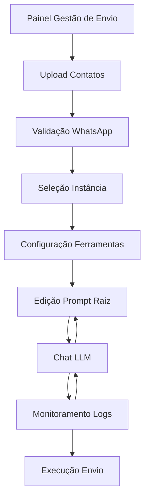

# Painel Gestão de Envio - Documento de Requisitos do Produto

## 1. Visão Geral do Produto

O Painel Gestão de Envio é uma nova interface que integra funcionalidades existentes do WhatsApp Marketing com capacidades de Chat LLM, organizadas em um layout de duas colunas com design glassmorphismo. O objetivo é reutilizar componentes já desenvolvidos e adicionar interação inteligente via LLM para otimizar processos de envio em massa.

## 2. Funcionalidades Principais

### 2.1 Papéis de Usuário

| Papel | Método de Registro | Permissões Principais |
|-------|-------------------|----------------------|
| Usuário Autenticado | Login existente do sistema | Acesso completo ao painel, upload de contatos, envio de mensagens, chat com LLM |

### 2.2 Módulo de Funcionalidades

Nossos requisitos do painel Gestão de Envio consistem nas seguintes páginas principais:

1. **Painel Gestão de Envio**: layout de duas colunas com chat LLM, logs, upload de contatos, seleção de instância e configurações.

### 2.3 Detalhes das Páginas

| Nome da Página | Nome do Módulo | Descrição da Funcionalidade |
|----------------|----------------|-----------------------------|
| Painel Gestão de Envio | Header Principal | Título do painel e navegação básica |
| Painel Gestão de Envio | Coluna Esquerda - Backlog & Logs | Exibir timeline de pensamentos LLM, registros de etapas executadas, logs de processos em tempo real com tags coloridas e timestamps |
| Painel Gestão de Envio | Coluna Esquerda - Chat LLM | Interface de conversa com LLM, input expansível, typing indicator, histórico de comandos, auto-scroll |
| Painel Gestão de Envio | Coluna Direita - Botão Enviar | Botão destacado para iniciar processo completo com estados visuais e progress bar |
| Painel Gestão de Envio | Coluna Direita - Upload Contatos | Reutilizar componente PhoneValidation: drag&drop de planilhas, input manual, validação automática WhatsApp |
| Painel Gestão de Envio | Coluna Direita - Seleção Instância | Reutilizar dropdown de instâncias com status de conexão e QR Code quando necessário |
| Painel Gestão de Envio | Coluna Direita - Ferramentas | Checkboxes para Evolution API, MCP e outras ferramentas futuras |
| Painel Gestão de Envio | Coluna Direita - Prompt Raiz | Editor de texto grande para prompt do sistema com variáveis e templates |

## 3. Processo Principal

### Fluxo do Usuário Principal

1. **Acesso ao Painel**: Usuário navega para o novo painel Gestão de Envio
2. **Upload de Contatos**: Utiliza componentes existentes para importar planilha ou inserir números manualmente
3. **Validação**: Sistema valida números WhatsApp automaticamente
4. **Configuração de Instância**: Seleciona instância WhatsApp ativa
5. **Configuração de Ferramentas**: Ativa/desativa Evolution API, MCP conforme necessário
6. **Edição de Prompt**: Define prompt raiz com variáveis personalizadas
7. **Interação com LLM**: Utiliza chat para refinar estratégia de envio
8. **Monitoramento**: Acompanha logs e backlog em tempo real
9. **Execução**: Inicia processo de envio com feedback visual

## 4. Design da Interface do Usuário

### 4.1 Estilo de Design

- **Cores Primárias**: Gradientes escuros com acentos neon (azul #3B82F6, verde #10B981, roxo #8B5CF6)
- **Cores Secundárias**: Tons de cinza com transparência para glassmorphismo
- **Estilo de Botão**: Glassmorphismo com `backdrop-blur-xl bg-white/10 border-white/20`
- **Fonte**: Sistema padrão com tamanhos responsivos (text-sm, text-base, text-lg)
- **Estilo de Layout**: Grid responsivo `grid-cols-1 lg:grid-cols-5` (3+2)
- **Sugestões de Emoji/Ícones**: 📤 (envio), 🤖 (LLM), 📱 (WhatsApp), ⚙️ (configurações), 🛠️ (ferramentas)

### 4.2 Visão Geral do Design das Páginas

| Nome da Página | Nome do Módulo | Elementos da UI |
|----------------|----------------|----------------|
| Painel Gestão de Envio | Header | Título centralizado com ícone 📤, fundo glassmorphismo |
| Painel Gestão de Envio | Coluna Esquerda (60%) | Dois cards empilhados: Backlog & Logs (superior) e Chat LLM (inferior), altura fixa com scroll interno |
| Painel Gestão de Envio | Coluna Direita (40%) | Stack vertical de 5 seções: Botão Enviar, Upload Contatos, Instância, Ferramentas, Prompt Raiz |
| Painel Gestão de Envio | Backlog & Logs | Lista scrollável com timestamps, tags coloridas por tipo, filtros de busca |
| Painel Gestão de Envio | Chat LLM | Área de conversa com mensagens do usuário (direita/azul) e LLM (esquerda/roxo), input expansível |
| Painel Gestão de Envio | Upload Contatos | Reutilização do componente PhoneValidation com drag&drop e preview |
| Painel Gestão de Envio | Seleção Instância | Dropdown com status colorido: 🟢Conectada 🟡Conectando 🔴Offline |
| Painel Gestão de Envio | Ferramentas | Checkboxes com ícones para Evolution API ☑️, MCP ☑️ |
| Painel Gestão de Envio | Prompt Raiz | Textarea grande com syntax highlighting para variáveis {{nome}}, {{telefone}} |

### 4.3 Responsividade

O produto é desktop-first com adaptação mobile. Em dispositivos móveis, as colunas se empilham verticalmente (grid-cols-1) e os componentes se ajustam para touch interaction. O chat LLM mantém funcionalidade completa em todas as resoluções.