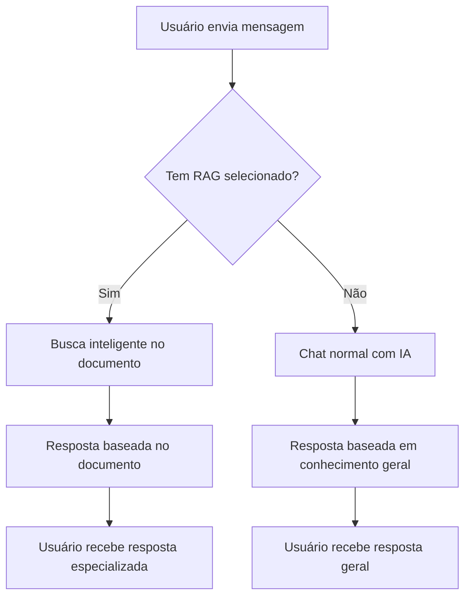

# 🔧 Correção: Chat Funcional Sem RAG

## 🚨 **Problema Identificado**

O sistema estava **forçando** o uso de RAG (Base de Conhecimento) para que o chat funcionasse, quando deveria funcionar assim:

❌ **Antes**: Chat só respondia se houvesse documentos RAG  
✅ **Agora**: Chat funciona normalmente + RAG como **complemento opcional**

---

## 🛠️ **O que foi Corrigido**

### **🧠 Backend (`server.cjs`)**

#### **❌ Comportamento Anterior:**
```javascript
} else {
  response = `Olá! Para que eu possa responder perguntas específicas, você precisa:
  1. Fazer upload de um arquivo de áudio na Base de Conhecimento
  2. Converter a transcrição em chunks (RAG)
  3. Selecionar o documento RAG no editor de prompt
  
  Assim terei contexto para dar respostas precisas e relevantes!`;
}
```

#### **✅ Comportamento Corrigido:**
```javascript
} else {
  // Chat normal sem RAG - funciona como assistente geral
  console.log('Chat sem RAG - modo assistente geral');
  
  try {
    const completion = await groq.chat.completions.create({
      messages: [
        {
          role: "system",
          content: `Você é um assistente de IA inteligente e prestativo. 
                   Responda de forma clara, precisa e útil. 
                   Se não souber algo, seja honesto sobre isso.`
        },
        {
          role: "user", 
          content: message
        }
      ],
      model: "llama-3.1-8b-instant",
      temperature: 0.7, // Mais criativo para chat geral
      max_tokens: 1000,
    });

    response = completion.choices[0]?.message?.content || 
               'Desculpe, não consegui processar sua solicitação.';
  } catch (groqError) {
    console.error('Erro na API do Groq:', groqError);
    response = 'Desculpe, ocorreu um erro ao processar sua mensagem. Tente novamente.';
  }
}
```

### **🎨 Frontend (`ChatInterface.tsx`)**

#### **❌ Mensagem Anterior:**
```
"Olá! Eu sou um assistente de IA. Para começar, faça o upload de um arquivo de áudio 
na seção de transcrição à direita para criar a base de conhecimento."
```

#### **✅ Mensagem Corrigida:**
```
"Olá! Eu sou seu assistente de IA. Você pode conversar comigo normalmente 
ou adicionar documentos na Base de Conhecimento para respostas mais especializadas."

💡 Dica: Use a Base de Conhecimento à direita para enriquecer minhas respostas!
```

---

## 🎯 **Como Funciona Agora**

### **💬 Chat Normal (Sem RAG)**
- **Pergunta qualquer coisa**: "Qual seu nome?", "Como está o tempo?", "Explique machine learning"
- **Resposta**: IA responde normalmente usando conhecimento geral
- **Temperature**: 0.7 (mais criativo e conversacional)

### **🧠 Chat Enriquecido (Com RAG)**
- **Seleciona documento RAG** no Editor de Prompt
- **Pergunta sobre o documento**: "Qual o horário de funcionamento?" 
- **Resposta**: IA busca no documento e responde com base no conteúdo específico
- **Temperature**: 0.2-0.3 (mais preciso e focado)

### **🔄 Flexibilidade Total**
- **Pode alternar** entre chat normal e RAG a qualquer momento
- **RAG é opcional** - enriquece quando necessário
- **Chat sempre funcional** - nunca fica bloqueado

---

## 📊 **Fluxo de Decisão**



---

## 🎉 **Benefícios da Correção**

### **🚀 Usabilidade**
- **Imediato**: Funciona assim que abre a aplicação
- **Intuitivo**: Não precisa aprender como usar RAG primeiro
- **Flexível**: Adiciona RAG quando quiser mais precisão

### **🎯 Casos de Uso**
- **Chat casual**: Perguntas gerais, conversas, dúvidas rápidas
- **Análise de documentos**: Upload + RAG para análise específica
- **Híbrido**: Alterna entre os dois conforme a necessidade

### **💡 Experiência do Usuário**
- **Sem barreiras**: Usuário pode começar a usar imediatamente
- **Descoberta natural**: Aprende sobre RAG quando precisar
- **Controle total**: Decide quando usar cada modo

---

## 🧪 **Teste da Correção**

### **✅ Agora Funcionam:**
- "Qual seu nome?" → Resposta normal da IA
- "Como funciona machine learning?" → Explicação geral
- "Conte uma piada" → IA responde naturalmente
- "Qual a capital do Brasil?" → Resposta direta

### **✅ RAG Continua Funcionando:**
- Seleciona documento → Pergunta específica → Resposta baseada no documento
- Busca inteligente continua otimizada
- Sistema de sincronização continua ativo

---

**Chat agora funciona como deveria: conversacional por padrão, especializado quando necessário!** 🎯✨