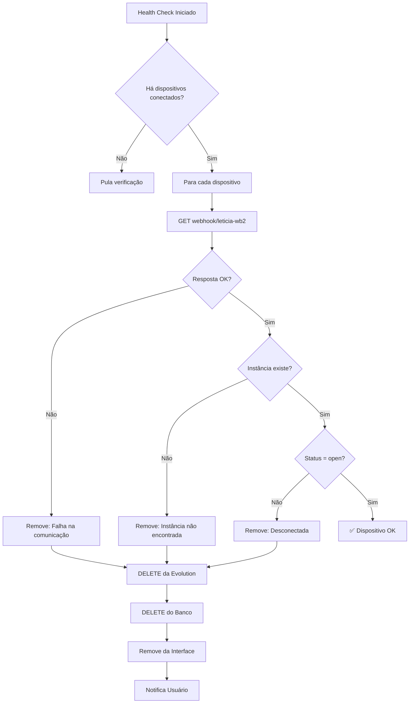

# Sistema de Health Check para Dispositivos WhatsApp

## 📋 Visão Geral

Sistema de monitoramento contínuo que verifica a cada 1 minuto se os dispositivos marcados como "conectados" no painel realmente continuam online na Evolution API. Remove automaticamente dispositivos que caíram, desconectaram ou se tornaram inválidos.

## 🎯 Problema Resolvido

**Cenários cobertos:**
1. **Evolution API cai**: Dispositivo aparece conectado mas API está offline
2. **Instância desconecta**: Usuário desconecta WhatsApp remotamente
3. **Conexão perdida**: Timeout, rede instável, etc.
4. **Instância deletada**: Alguém remove diretamente da Evolution
5. **Status inconsistente**: Banco mostra "conectado" mas Evolution mostra outra coisa

## ⚙️ Funcionamento

### 1. Intervalo de Verificação
```typescript
// Executa a cada 1 minuto (60000ms)
setInterval(() => {
  checkConnectedDevicesHealth()
}, 60000)
```

### 2. Filtro Inteligente
- ✅ Verifica apenas dispositivos com `connectionInfo` (conectados)
- ❌ Ignora dispositivos aguardando QR Code
- ⚡ Executa verificações em paralelo (não bloqueia UI)

### 3. Fluxo de Verificação



## 🔍 Verificações Realizadas

### Check 1: Comunicação com Evolution API
```typescript
const response = await fetch(`https://n8n.sofia.ms/webhook/leticia-wb2?instanceName=${deviceName}`)
if (!response.ok) {
  // Remove: Evolution não responde
}
```
**Cenários:**
- Evolution API offline
- Webhook indisponível
- Timeout de rede

### Check 2: Existência da Instância
```typescript
const instanceData = data.data?.find(instance => instance.name === deviceName)
if (!instanceData) {
  // Remove: Instância não existe mais
}
```
**Cenários:**
- Instância deletada manualmente
- Nome da instância mudou
- Dados corrompidos

### Check 3: Status de Conexão
```typescript
if (instanceData.connectionStatus !== 'open') {
  // Remove: Não está conectada
}
```
**Status possíveis:**
- `open` ✅ Conectado (OK)
- `connecting` ⚠️ Conectando (Remove)
- `close` ❌ Desconectado (Remove)
- `refused` ❌ Recusado (Remove)

## 📊 Logs do Console

```bash
# Início do health check
🏥 Health check: Verificando 3 dispositivo(s) conectado(s)

# Dispositivo OK
✅ Health check OK: meu-whatsapp (open)

# Problemas detectados
⚠️ Health check falhou para teste-zap: 500
⚠️ Instância dispositivo-antigo não encontrada na Evolution
⚠️ Instância temporario desconectada: close

# Remoção automática
🔌 Removendo dispositivo desconectado: teste-zap (Falha na comunicação com Evolution)
```

## 🛡️ Proteções Implementadas

### 1. Cleanup Automático
```typescript
// Remove de TODOS os lugares:
✅ Evolution API (DELETE webhook)
✅ Banco de dados SQLite
✅ Interface do usuário
✅ Notifica usuário
```

### 2. Tratamento de Erros
- Não bloqueia verificação de outros dispositivos
- Logs detalhados para debug
- Continua funcionando mesmo se Evolution falhar
- Notificação clara ao usuário

### 3. Gestão de Recursos
```typescript
// Para health check se não há dispositivos conectados
if (!hasConnectedDevices && healthCheckInterval.current) {
  clearInterval(healthCheckInterval.current)
  healthCheckInterval.current = null
}
```

## 🚀 Inicialização

### 1. Ao Carregar Dispositivos
```typescript
loadDevices() → startHealthCheck()
```

### 2. Ao Conectar Novo Dispositivo
```typescript
// useEffect monitora mudanças em devices
useEffect(() => {
  if (hasConnectedDevices) {
    startHealthCheck()
  }
}, [devices])
```

### 3. Execução Imediata + Recorrente
```typescript
// Verifica logo ao iniciar
checkConnectedDevicesHealth()

// Depois a cada 1 minuto
setInterval(checkConnectedDevicesHealth, 60000)
```

## 📈 Métricas

| Métrica | Valor | Descrição |
|---------|-------|-----------|
| **Intervalo** | 60s | Tempo entre verificações |
| **Timeout implícito** | ~10s | Timeout do fetch (padrão) |
| **Dispositivos/check** | Ilimitado | Verifica todos conectados |
| **Execução** | Paralela | Não bloqueia UI |
| **Auto-start** | Sim | Inicia automaticamente |
| **Auto-stop** | Sim | Para se não há conectados |

## 🎯 Exemplos de Uso

### Cenário 1: Evolution API Cai
```bash
# 14:00 - Dispositivo conectado
✅ Health check OK: producao (open)

# 14:01 - Evolution API fica offline
⚠️ Health check falhou para producao: Failed to fetch
🔌 Removendo dispositivo desconectado: producao (Erro de conexão)
❌ Dispositivo "producao" foi removido: Erro de conexão
```

### Cenário 2: Usuário Desconecta WhatsApp
```bash
# 15:30 - Dispositivo conectado
✅ Health check OK: pessoal (open)

# 15:31 - Usuário desconecta pelo app
⚠️ Instância pessoal desconectada: close
🔌 Removendo dispositivo desconectado: pessoal (Status: close)
❌ Dispositivo "pessoal" foi removido: Status: close
```

### Cenário 3: Instância Deletada Manualmente
```bash
# 09:00 - Dispositivo conectado
✅ Health check OK: teste (open)

# 09:01 - Admin deleta via Evolution dashboard
⚠️ Instância teste não encontrada na Evolution
🔌 Removendo dispositivo desconectado: teste (Instância não encontrada)
❌ Dispositivo "teste" foi removido: Instância não encontrada
```

## 🔄 Sincronização

O sistema mantém 3 camadas sincronizadas:

```
┌─────────────────────────────────────┐
│     Evolution API (Source of Truth) │
│  ┌─────────────────────────────┐    │
│  │ Instâncias Ativas           │    │
│  └─────────────────────────────┘    │
└─────────────────┬───────────────────┘
                  │
        Health Check (cada 1min)
                  │
                  ▼
┌─────────────────────────────────────┐
│          Banco de Dados SQLite      │
│  ┌─────────────────────────────┐    │
│  │ whatsapp_devices table      │    │
│  └─────────────────────────────┘    │
└─────────────────┬───────────────────┘
                  │
         React State Sync
                  │
                  ▼
┌─────────────────────────────────────┐
│       Interface do Usuário          │
│  ┌─────────────────────────────┐    │
│  │ DevicesPanel Component      │    │
│  └─────────────────────────────┘    │
└─────────────────────────────────────┘
```

## 🧹 Cleanup ao Desmontar

```typescript
useEffect(() => {
  return () => {
    if (healthCheckInterval.current) {
      clearInterval(healthCheckInterval.current)
    }
  }
}, [])
```

## 💡 Benefícios

1. **Confiabilidade**: Estado sempre reflete realidade da Evolution
2. **Automação**: Remove dispositivos problemáticos automaticamente
3. **Feedback**: Usuário sabe quando dispositivo foi removido e por quê
4. **Economia**: Não faz requisições desnecessárias (só conectados)
5. **Performance**: Intervalo de 1 minuto não sobrecarrega API
6. **Resiliência**: Continua funcionando mesmo se Evolution falhar temporariamente

## 🔧 Configuração

### Intervalo Personalizável
```typescript
// Alterar de 1 minuto para outro valor:
healthCheckInterval.current = setInterval(() => {
  checkConnectedDevicesHealth()
}, 30000) // 30 segundos
```

### Desabilitar Temporariamente
```typescript
// Para parar health check:
if (healthCheckInterval.current) {
  clearInterval(healthCheckInterval.current)
  healthCheckInterval.current = null
}
```

## 📚 Referências

- **Endpoint verificação**: `GET https://n8n.sofia.ms/webhook/leticia-wb2?instanceName=X`
- **Endpoint remoção**: `DELETE https://n8n.sofia.ms/webhook/leticia-wb3`
- **Tabela banco**: `whatsapp_devices` em `/database/schema.sql`
- **Componente**: `/src/components/DevicesPanel.tsx`
