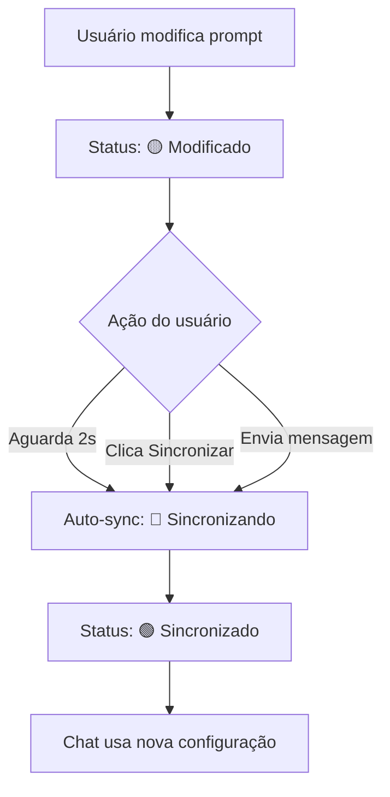

# 🔄 Sistema de Sincronização de Prompt em Tempo Real

## 🎯 **Problema Resolvido**

Antes da implementação, quando você alterava o prompt no painel, o chat não sabia sobre essas mudanças e continuava respondendo como se o prompt anterior ainda estivesse ativo. Agora implementamos um **sistema de sincronização visual em tempo real** que garante que você sempre saiba o status do seu prompt.

---

## ✨ **Como Funciona**

### **🔍 Estados de Sincronização**

#### **🟢 Sincronizado** 
- ✅ Prompt e RAG estão atualizados
- ✅ Chat responderá usando a configuração atual
- **Indicador:** Ponto verde com "Sincronizado"

#### **🟡 Modificado**
- ⚠️ Você alterou o prompt ou mudou o RAG
- ⚠️ Chat ainda usa a versão anterior
- **Indicador:** Ponto laranja pulsante com "Prompt alterado" / "Modificado"
- **Ação:** Botão "Sincronizar" disponível

#### **🔵 Sincronizando**
- 🔄 Sistema está processando as mudanças
- 🔄 Aguarde a sincronização completar
- **Indicador:** Ponto azul girando com "Sincronizando..."

---

## 🎮 **Como Usar**

### **📝 Modificação Automática**
1. **Digite no prompt** ou **mude o RAG selecionado**
2. Status muda para **🟡 Modificado** imediatamente
3. Após **2 segundos** de inatividade, sincroniza automaticamente
4. Status volta para **🟢 Sincronizado**

### **⚡ Sincronização Manual**
1. Quando o status estiver **🟡 Modificado**
2. Clique no botão **"Sincronizar"** no Editor de Prompt
3. Status muda para **🔵 Sincronizando** e depois **🟢 Sincronizado**

### **💬 Sincronização por Mensagem**
1. Quando você **envia uma mensagem** no chat
2. Sistema sincroniza automaticamente **antes** de processar
3. Garante que a resposta use a configuração mais atual

---

## 📍 **Onde Ver os Indicadores**

### **🏠 Header do Chat**
```
Chat IA • [Nome do RAG selecionado]     🟢 Sincronizado
```

### **✏️ Header do Editor de Prompt**
```
Editor de Prompt   🟡 Modificado [Sincronizar]     [RAG Selector ▼]
```

---

## 🔧 **Detalhes Técnicos**

### **⏱️ Timing**
- **Debounce**: 2 segundos após parar de digitar
- **Sincronização Manual**: Instantânea
- **Sincronização por Mensagem**: Automática antes do envio

### **🎯 Triggers de Modificação**
- Alteração no texto do prompt
- Mudança do RAG selecionado
- Qualquer alteração na configuração

### **💾 Estados Persistidos**
- Último prompt sincronizado
- Último RAG sincronizado
- Status atual de sincronização

---

## 🚀 **Benefícios**

### **👁️ Visibilidade Total**
- Sempre saiba se suas mudanças estão ativas
- Feedback visual imediato
- Controle completo do processo

### **🎯 Precisão Garantida**
- Chat sempre usa a configuração mais recente
- Sem respostas baseadas em prompts antigos
- Sincronia perfeita entre interface e backend

### **⚡ Flexibilidade**
- Auto-sincronização conveniente
- Controle manual quando necessário
- Sincronização inteligente por contexto

---

## 📋 **Fluxo Completo**



---

## 🎨 **Design System**

### **🎨 Cores dos Indicadores**
- **Verde**: `bg-green-500` - Tudo certo
- **Laranja**: `bg-orange-500` - Atenção necessária
- **Azul**: `bg-blue-500` - Processando

### **🔄 Animações**
- **Pulse**: Para estados de espera/atenção
- **Spin**: Para estados de processamento
- **Estático**: Para estados estáveis

### **📱 Responsividade**
- Indicadores compactos no mobile
- Textos adaptativos por tamanho de tela
- Botões otimizados para touch

---

**Sistema implementado para máxima clareza e controle do usuário!** 🎯✨